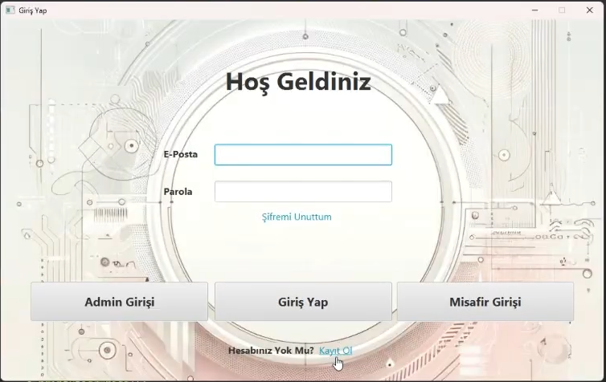
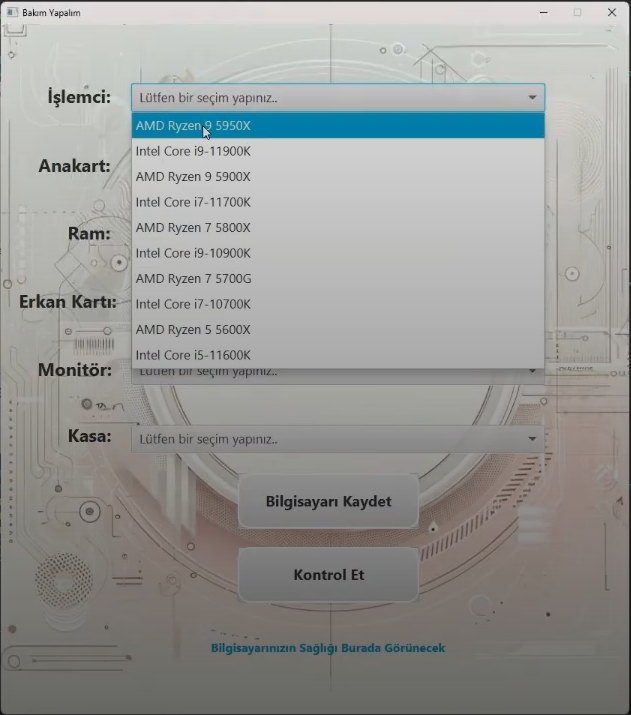
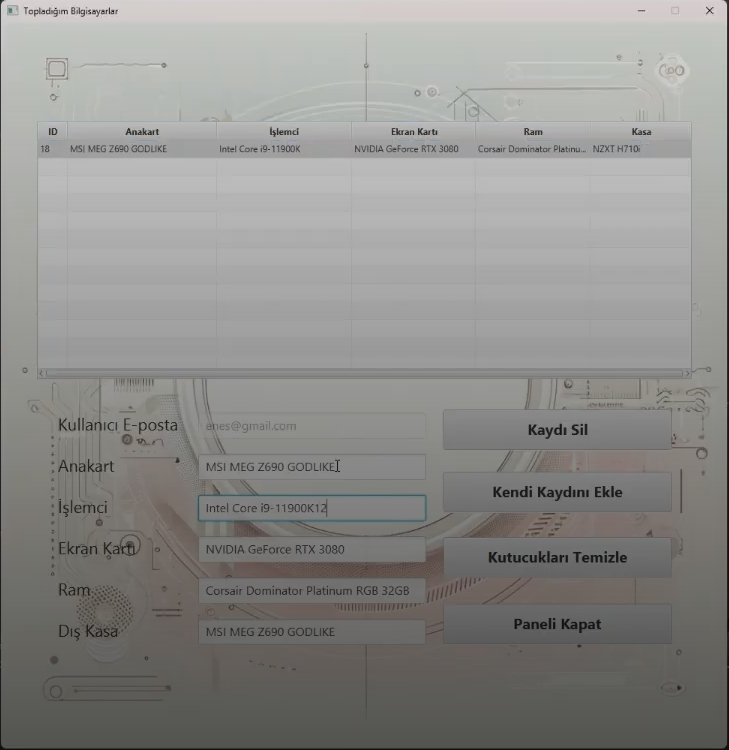
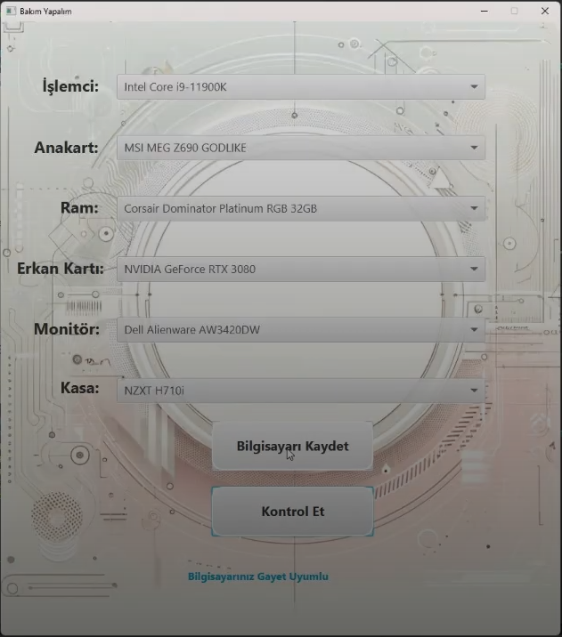
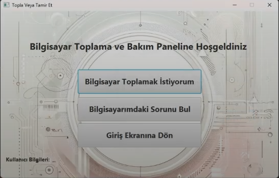

# 💻 Bilgisayar Toplama Otomasyonu

Bu proje, kullanıcıların bilgisayar bileşenlerini seçip, uyumluluk kontrolü yapabilecekleri ve kaydedebilecekleri bir JavaFX tabanlı masaüstü uygulamasıdır.

## 🚀 Özellikler

- **👤 Kullanıcı Yönetimi**
  - 🔑 Kullanıcı girişi
  - 📝 Kayıt olma
  - 🔄 Şifre sıfırlama
  - 👨‍💼 Admin paneli

- **🖥️ Bilgisayar Toplama**
  - ⚡ İşlemci seçimi
  - 🏗️ Anakart seçimi
  - 💾 RAM seçimi
  - 🎮 Ekran kartı seçimi
  - 🖥️ Monitör seçimi
  - 📦 Kasa seçimi

- **✅ Uyumluluk Kontrolü**
  - 🔍 Bileşen uyumluluk kontrolü
  - ⚠️ Otomatik uyarı sistemi
  - 📊 Performans bazlı öneriler

- **💾 Kayıt Sistemi**
  - 💾 Toplanan bilgisayarları kaydetme
  - 👀 Kayıtlı bilgisayarları görüntüleme
  - ✏️ Düzenleme ve silme işlemleri

## 🛠️ Teknolojiler

- ☕ Java 8+
- 🎨 JavaFX
- 🗄️ MySQL
- 🔌 JDBC

## 📋 Gereksinimler

- ☕ Java Development Kit (JDK) 8 veya üzeri
- 🗄️ MySQL Server
- 🎨 JavaFX kütüphanesi
- 🔌 MySQL Connector/J

## 🔧 Kurulum

1. 📊 MySQL veritabanını kurun:
```sql
CREATE DATABASE bilgisayar_toplama_otomasyonu;
```

2. 📝 Veritabanı tablolarını oluşturun:
```sql
-- monitor_table
CREATE TABLE monitor_table (
    monitor_id INT PRIMARY KEY,
    monitor_isim VARCHAR(100)
);

-- islemci_ram
CREATE TABLE islemci_ram (
    islemci_id INT PRIMARY KEY,
    islemci_isim VARCHAR(100)
);

-- anakart_table
CREATE TABLE anakart_table (
    anakart_id INT PRIMARY KEY,
    anakart_isim VARCHAR(100)
);

-- kasa_table
CREATE TABLE kasa_table (
    kasa_id INT PRIMARY KEY,
    kasa_isim VARCHAR(100)
);

-- ekrankarti_table
CREATE TABLE ekrankarti_table (
    ekrankarti_id INT PRIMARY KEY,
    ekrankarti_isim VARCHAR(100)
);

-- kullanici_sistemi_table
CREATE TABLE kullanici_sistemi_table (
    kullanici_sistem_id INT PRIMARY KEY AUTO_INCREMENT,
    kullanici_mail VARCHAR(100),
    kullanici_anakart VARCHAR(100),
    kullanici_islemci VARCHAR(100),
    kullanici_ekrankarti VARCHAR(100),
    kullanici_ram VARCHAR(100),
    kullanici_kasa VARCHAR(100)
);
```

3. 📥 Projeyi klonlayın:
```bash
git clone [proje-url]
```

4. 🔌 Veritabanı bağlantı bilgilerini güncelleyin:
`VeritabaniUtil.java` dosyasında bağlantı bilgilerini düzenleyin:
```java
conn = DriverManager.getConnection("jdbc:mysql://localhost/bilgisayar_toplama_otomasyonu","root","mysql");
```

5. 🚀 Projeyi derleyin ve çalıştırın.

## 🎯 Kullanım

1. ⚡ Uygulamayı başlatın
2. 🔑 Giriş yapın veya kayıt olun
3. 🖥️ Bilgisayar bileşenlerini seçin
4. ✅ "Kontrol Et" butonuna tıklayarak uyumluluğu kontrol edin
5. 💾 "Bilgisayarı Kaydet" butonu ile seçimlerinizi kaydedin

## 📝 Veritabanı Yapısı

### 📊 Tablolar ve İlişkiler

- 🖥️ `monitor_table`: Monitör bilgileri
- ⚡ `islemci_ram`: İşlemci ve RAM bilgileri
- 🏗️ `anakart_table`: Anakart bilgileri
- 📦 `kasa_table`: Kasa bilgileri
- 🎮 `ekrankarti_table`: Ekran kartı bilgileri
- 👤 `kullanici_sistemi_table`: Kullanıcı bilgileri ve toplanan bilgisayarlar

## 🔒 Güvenlik

- 🔐 Veritabanı bağlantısı şifreli
- 🛡️ SQL injection koruması
- 👥 Kullanıcı yetkilendirme sistemi
- 📝 Hata yönetimi ve loglama

## 🐛 Hata Ayıklama

Uygulama çalışırken karşılaşılabilecek hatalar:

1. **❌ Veritabanı Bağlantı Hatası**
   - 🔄 MySQL servisinin çalıştığından emin olun
   - 🔍 Bağlantı bilgilerini kontrol edin

2. **⚠️ Bileşen Seçim Hatası**
   - 📝 Tüm zorunlu alanların doldurulduğundan emin olun
   - ✅ Uyumlu bileşenler seçin

3. **❌ Kayıt Hatası**
   - 🔑 Giriş yaptığınızdan emin olun
   - 📝 Zorunlu alanları doldurun

## 📄 Lisans

Bu proje MIT lisansı altında lisanslanmıştır. Detaylar için [LICENSE](LICENSE) dosyasını inceleyebilirsiniz.

## 👥 Katkıda Bulunma

1. 🍴 Fork edin
2. 🌿 Feature branch oluşturun (`git checkout -b feature/amazing-feature`)
3. 💾 Değişikliklerinizi commit edin (`git commit -m 'Add some amazing feature'`)
4. 📤 Branch'inizi push edin (`git push origin feature/amazing-feature`)
5. 🔄 Pull Request açın

## 📧 İletişim

👤 Proje Sahibi - [@yakupKutluksaman](https://github.com/yakupKutluksaman)

🔗 Proje Linki: [https://github.com/yakupKutluksaman/bilgisayarToplamaOtomasyonu](https://github.com/yakupKutluksaman/bilgisayarToplamaOtomasyonu)

## 📸 Ekran Görüntüleri

### 🏠 Ana Ekran


### 🔑 Giriş Ekranı


### 👨‍💼 Admin Paneli


### 🖥️ Bilgisayar Kaydetme


### 📋 Toplanan Bilgisayarlar


### 🔧 Bakım Ekranı


### 🛠️ Toplatamir Etme
 